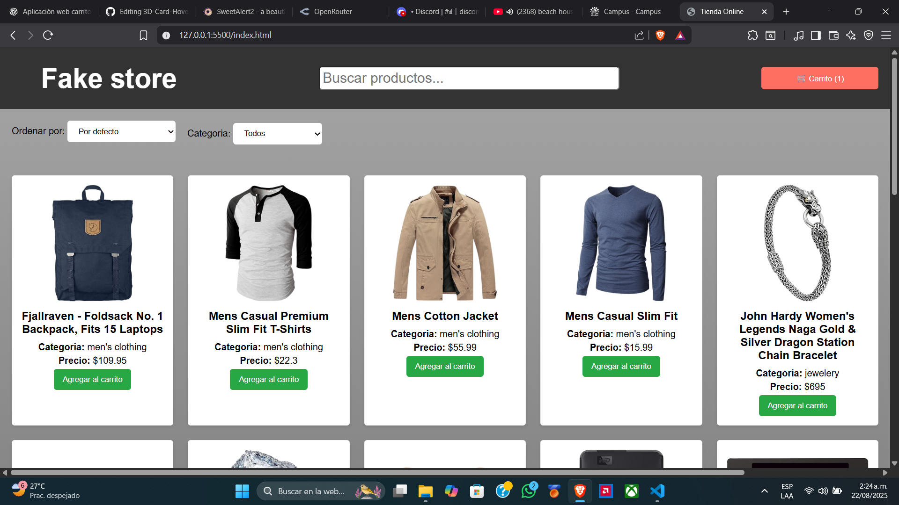
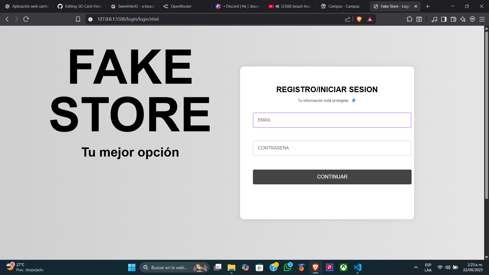

# 📌 Descripción del Proyecto

El proyecto consiste en una aplicación web de **tienda virtual** desarrollada con **HTML, CSS y JavaScript**, que integra un sistema de visualización de productos y un módulo de autenticación de usuarios.

---

## 🛍️ Productos dinámicos desde API
- Los artículos se obtienen en tiempo real desde la **Fake Store API**.  
- Los productos se muestran en el DOM con su **imagen, título, descripción, precio y categoría**.  
- El usuario puede **filtrar y ordenar** productos por categoría, precio o nombre, y añadirlos al carrito de compras.  

---

## 🛒 Carrito de Compras interactivo
- Permite **agregar, eliminar y vaciar productos** con actualización dinámica de cantidades.  
- El **total de la compra** se calcula automáticamente.  
- Se incluye un **modal** para visualizar los productos seleccionados antes de hacer el pedido.  

---

## 🔑 Login y Registro de usuarios
- El sistema de autenticación está hecho con **JavaScript y SweetAlert2**.  
- Los usuarios pueden **registrarse** ingresando su correo y contraseña, o **iniciar sesión** si ya existen.  
- La información de usuarios se gestiona con **sessionStorage**, manteniendo la sesión activa durante la navegación.  
- Al iniciar sesión o registrarse, se muestra una **notificación moderna con SweetAlert2** y el usuario es redirigido a la tienda.  

---

## 📱 Interfaz adaptable (Responsive Design)
- Se aplicaron **media queries** para que la aplicación se adapte correctamente en **pantallas de portátiles, tablets y móviles**.  
- La experiencia de usuario se mantiene **fluida y clara** en diferentes resoluciones.  

---
## 📸 Vista Previa




---
## 🛠️ Cómo ejecutar
1. **Clonar el repositorio**  
   Abre la terminal y ejecuta:  
   ```bash
   git clone https://github.com/FreddyR03/Proyecto_JS.git
   ```

2. Abre el proyecto
   - Opción 1: En VS Code con Live Server → clic derecho en index.html > Open with Live Server.  
   - Opción 2: Abre index.html directamente en el navegador.

## 📁 Estructura del Proyecto

```plaintext
Proyecto_JS/
├── index.html
├── style.css
├── script.js
├── README.md
│
├── analisis/
│   └── analisis.md
│
├── imagenes/
│   ├── imagen.png
│   ├── imagen2.png
│   └── imagen3.png
│
├── login/
│   ├── login.html
│   ├── login.css
│   └── login.js
│
└── maquetación/
    └── fake store.pdf
```